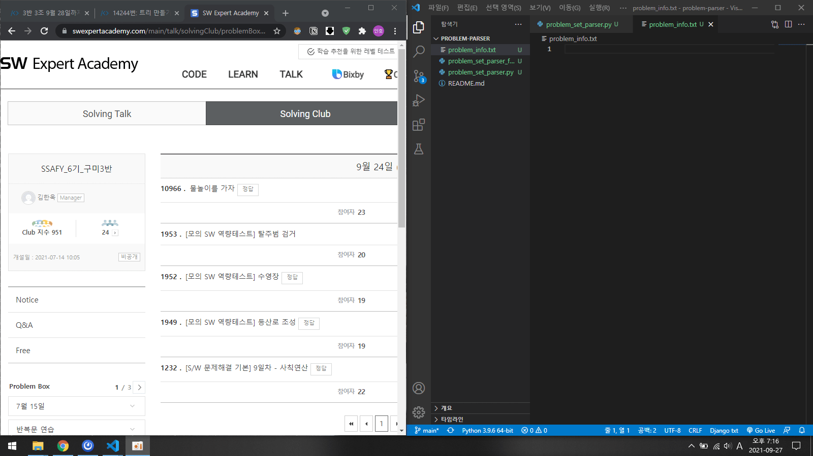

# online-judge-problem-parser
알고리즘 문제들 이름과 똑같은  
python 파일, input 텍스트 파일을 만들어줍니다.

## 사용법

1. 문제 목록 페이지에서 문제들 정보를 Ctrl + C 한 후, 
2. problem_info.txt에 Ctrl + V.
3. ... parser.py를 실행.
4. 완성!

> 필요에 따라 원하는 대로 수정해서 사용하셔도 좋습니다.

## 아쉬운 점

URL을 통해 '원하는 날짜'의 문제들 & input.txt 내용까지 전부 받아오면 더 좋을 것 같습니다.

이를 위해선 로그인하고 원하는 페이지까지 가는 기능이 필요할 거 같은데,  
Selenium을 이용하려고 보니 꽤나 복잡할 것 같습니다.

혹시 좋은 의견 있으신 분은 공유해주시면 감사드리겠습니다!